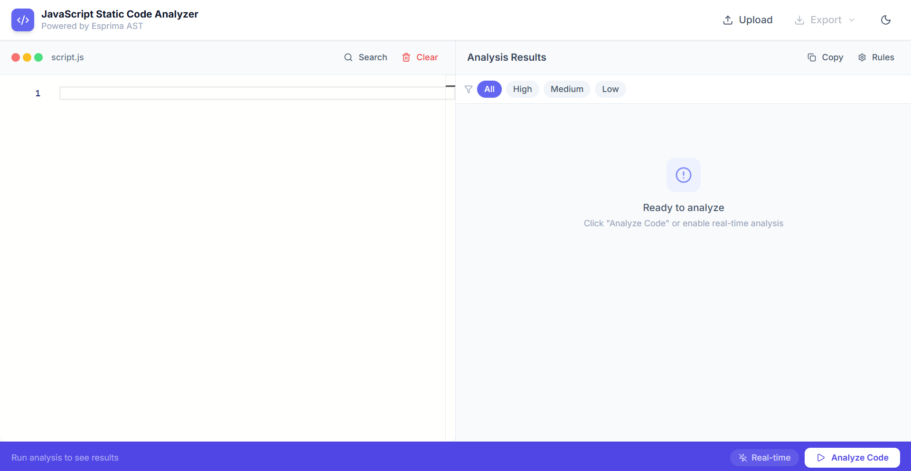
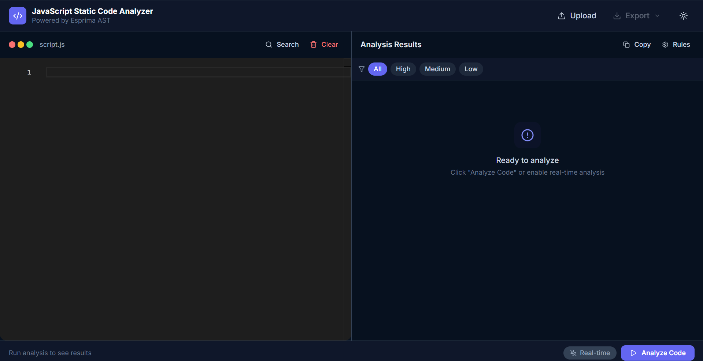
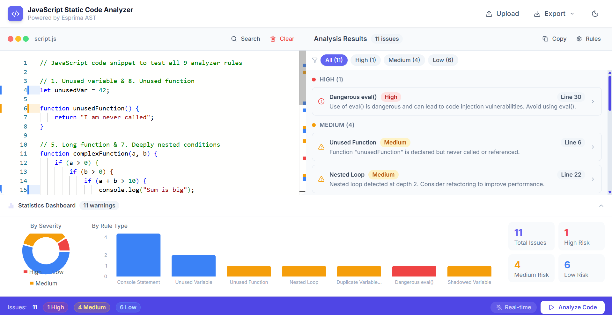

# ⚡ JS Static Analyzer — Full-Stack JavaScript Code Analysis Tool

JS Static Analyzer is a **full-stack developer tool** that performs **static analysis of JavaScript code** and provides insights into the structure and metrics of the code.

The platform allows developers to write JavaScript code inside an interactive editor, upload `.js` files for analysis, and visualize **code statistics and structural insights** through a clean dashboard interface.

This project demonstrates **modern full-stack development practices** by combining a **React-based UI, Node.js backend services, and JavaScript parsing techniques** to analyze code structure and display meaningful metrics.

---

# 📂 Project Structure
```
js_analyzer/

├── client/                       # Frontend (React + Vite)
│   ├── public/                    # Static assets
│   ├── src/
│   │   ├── assets/                # Images and static resources
│   │   ├── components/            # Reusable UI components
│   │   │   ├── CodeEditor.jsx     # JavaScript code editor
│   │   │   ├── Navbar.jsx         # Application navigation bar
│   │   │   ├── ResultsPanel.jsx   # Displays analysis results
│   │   │   ├── StatsDashboard.jsx # Code metrics dashboard
│   │   │   └── StatusBar.jsx      # Status and feedback messages
│   │   ├── App.jsx                # Root React component
│   │   ├── main.jsx               # React application entry point
│   │   ├── index.css              # Global styling
│   │   └── eslint.config.js       # ESLint configuration
│   ├── index.html                 # HTML template
│   ├── package.json               # Frontend dependencies
│   ├── tailwind.config.js         # Tailwind CSS configuration
│   ├── postcss.config.js          # PostCSS configuration
│   └── vite.config.js             # Vite build configuration

├── server/                        # Backend logic
│   ├── analyzer.js                # JavaScript code analysis module
│   ├── server.js                  # Express server entry point
│   ├── package.json               # Backend dependencies
│   └── rules/                     # Folder containing analysis rules

├── node_modules/                  # Installed packages (root)
├── package.json                   # Root configuration file
└── README.md                      # Project documentation
```
---
## 📸 Screenshots

### 💻 JS Analyzer Views

| 🌞 **Light Mode** |
|:--:|
| [](screenshots/js_analyzer_light_mode.png) |

| 🌙 **Dark Mode** |
|:--:|
| [](screenshots/js_analyzer_dark_mode.png) |

| 🖥️ **Analysis Results** |
|:--:|
| [](screenshots/analysis_results.png) |


⚡Code. Analyze. Improve. Repeat.

---

# ✨ Key Highlights

- ⚡ Interactive JavaScript code editor
- 🧠 Static code analysis using AST parsing
- 📊 Code metrics visualization dashboard
- 📂 Upload JavaScript files for analysis
- 📋 Copy analysis results instantly
- 📤 Export analysis results
- 🔄 Full-stack architecture (React + Node.js)
- 🎨 Responsive UI with Tailwind CSS


# 💻 Core Features


- 🧑‍💻 Interactive Code Editor
- 📂 JavaScript File Upload
- 🔍 Static Code Analysis
- 📊 Code Metrics Dashboard
- 📋 Copy Analysis Results
- 📤 Export Analysis Results
- 📡 Backend Analysis Module


Workflow:

```
User Code → Analysis Engine → Code Metrics → Dashboard Visualization
```


# 🧩 Tech Stack

## Frontend

- React
- Vite
- Tailwind CSS

## Backend

- Node.js
- Express.js

## Code Analysis

- Esprima  (JavaScript Parser)

## Developer Tools

- Git
- GitHub
- npm


# 📈 Engineering Highlights

- Built a **modular React component architecture**
- Designed an **interactive code analysis dashboard**
- Implemented **backend code analysis logic**
- Structured the project with **separate frontend and backend modules**
- Created a **developer-focused UI for analyzing code structure**

# 🚀 Installation & Setup

## 1️⃣ Clone the Repository

```bash
git clone https://github.com/adiba-anwar01/js-static-analyzer.git
```


## 2️⃣ Install Dependencies

Install dependencies for both **client and server**.

### Frontend

```bash
cd client
npm install
```

### Backend

```bash
cd server
npm install
```


## 3️⃣ Run the Application

Start the frontend development server:

```bash
cd client
npm run dev
```

Run the backend server:

```bash
cd server
node server.js
```


# 🌱 Current Scope

- ✔ JavaScript code input via editor
- ✔ File upload support for `.js` files
- ✔ Backend code analysis
- ✔ Code metrics visualization dashboard
- ✔ Copy and export analysis results
- ✔ Modular React component design
- ✔ Full-stack architecture with separated frontend and backend


# 🔮 Future Enhancements

- 🚀 Advanced code complexity analysis
- 🧠 AI-powered code quality suggestions
- 📊 More detailed code metrics and charts
- 🔎 Code smell detection and linting features
- 📁 Multi-file project analysis


# 🎨 Customization Guidelines

You can extend the project easily:

- Add new analysis rules inside `server/analyzer.js`
- Extend dashboard metrics in `StatsDashboard.jsx`
- Modify editor behavior in `CodeEditor.jsx`
- Update UI styling via Tailwind configuration


# 🤝 Contributing

💡 **Have ideas to enhance StriveFit?**  
Feel free to **fork this repository**, **open issues**, or **submit pull requests**.  
Thoughtful contributions, improvements, and feedback are always welcome.

📬 **Contact Me:**  
📧 Email: **adibadeveloper02@gmail.com**

✨ Crafted with passion ❤️ by Adiba, focusing on building **scalable**, **interactive**, and **user-friendly** web applications.  

⭐ If you found this project useful, consider **starring the repository**.  
